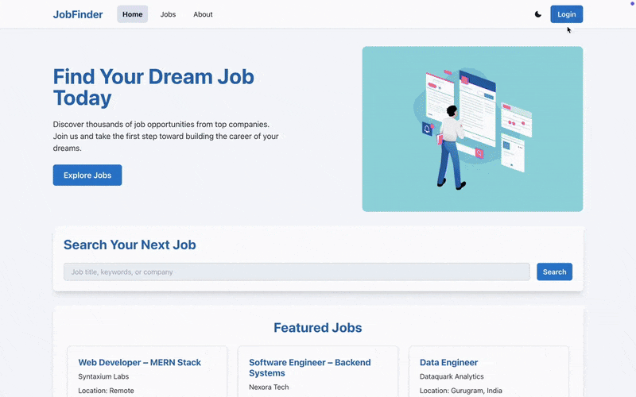

# 🚀 JobFinder

JobFinder is a comprehensive job search web application that simplifies the job hunting process for both job seekers and employers. Built with modern web technologies, it provides a seamless experience for browsing, filtering, and applying to job opportunities from verified companies across various industries.



## ✨ Key Features

### 🎯 For Job Seekers

- **Smart Job Search**: Browse through carefully curated job listings from top companies
- **Advanced Filtering**: Filter opportunities by job title, location, experience level, and required skills
- **Real-time Updates**: Get instant access to the latest job postings through Firestore integration
- **Responsive Design**: Access the platform seamlessly across desktop, tablet, and mobile devices
- **Secure Authentication**: Safe and secure login/signup process powered by Firebase Auth

### 🏢 For Employers

- **Easy Job Posting**: Simple interface for posting new job opportunities
- **Real-time Management**: Instant updates and management of job listings
- **Verified Platform**: Showcase opportunities on a trusted, professional platform

### 🔧 Technical Highlights

- **Lightning Fast**: Optimized React components for superior performance
- **Modern UI**: Clean, intuitive interface built with Chakra UI
- **Cloud-Powered**: Fully hosted on Firebase with global CDN
- **Real-time Database**: Instant data synchronization with Firestore
- **Mobile-First**: Responsive design that works perfectly on all screen sizes

## 🛠️ Tech Stack

### Frontend

- **React 18+** - Modern JavaScript library for building user interfaces
- **Chakra UI** - Simple, modular, and accessible component library
- **React Router** - Declarative routing for React applications

### Backend & Database

- **Firebase** - Comprehensive app development platform
- **Firestore** - NoSQL document database for real-time data storage
- **Firebase Authentication** - Secure user authentication system
- **Firebase Hosting** - Fast and secure web hosting

## ⚙️ Installation & Setup

### Prerequisites

Make sure you have the following installed on your machine:

- **Node.js** (v14 or higher) - [Download here](https://nodejs.org/)
- **npm** (v6 or higher) or **yarn**
- **Git** - [Download here](https://git-scm.com/)

### Quick Start

1. **Clone the Repository**

   ```
   git clone https://github.com/mohanseetha/job-finder.git
   cd job-finder
   ```

2. **Install Dependencies**

   ```
   npm install
   # or
   yarn install
   ```

3. **Firebase Configuration**

   a. Visit the [Firebase Console](https://console.firebase.google.com/)

   b. Create a new project or use an existing one

   c. Enable **Firestore Database** and **Authentication**

   d. Create a `firebase.js` file in the `src` directory:

   ```javascript
   import { initializeApp } from "firebase/app";
   import { getFirestore } from "firebase/firestore";
   import { getAuth } from "firebase/auth";

   const firebaseConfig = {
     apiKey: "your-api-key",
     authDomain: "your-auth-domain",
     projectId: "your-project-id",
     storageBucket: "your-storage-bucket",
     messagingSenderId: "your-sender-id",
     appId: "your-app-id",
   };

   const app = initializeApp(firebaseConfig);
   export const db = getFirestore(app);
   export const auth = getAuth(app);
   ```

4. **Start Development Server**

   ```bash
   npm start
   # or
   yarn start
   ```

   The application will open at [http://localhost:3000](http://localhost:3000)

## 📊 Database Schema

### Jobs Collection Structure

```javascript
{
  id: "document_id",
  title: "string",           // Job title
  company: "string",         // Company name
  location: "string",        // Job location
  experience: "number",      // Experience required
  skills: ["array"],         // Required skills
  type: "string",           // Full-time, Part-time, Contract
  salary: "number",         // Salary range
  description: "string",    // Job description
  responsibilites: ["string"]  // Job responsibilities
  requirements: ["string"]  // Job requirements
  postedDate: "timestamp",  // When job was posted
}
```

**Made by [Mohan Seetha](https://github.com/mohanseetha)**
